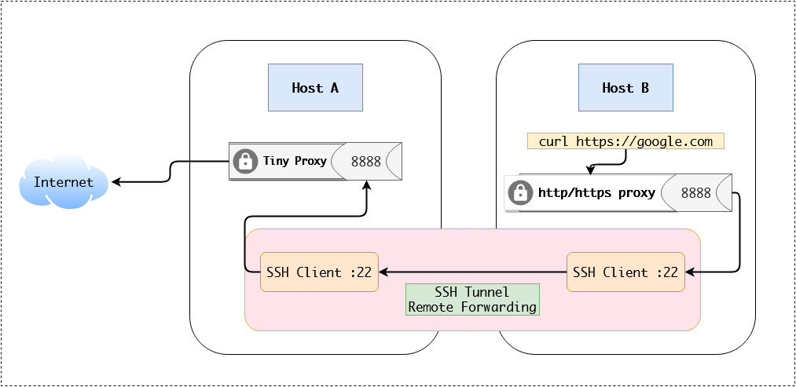

# SSH tunnel Give server access to Internet, via client connecting by SSH
ในกรณีที่เรามี Server ที่เป็น private zone ที่ไม่สามารถใช้งาน internet ได้ และสามารถเข้าถึงได้จาก VPN เท่านั้น
วิธีนี้จะทำให้ Server สามารถใช้งาน Internet ได้จากเครื่อง Computer ของเราแทน โดยให้เครื่อง Computer ของเรานั้นเป็น proxy server



## 1. Run Tinyproxy Server Host 1
> Tinyproxy server default port 8888

```
# docker-compose -f tinyproxy/docker-compose.yaml up -d
```

## 2. SSH Tunnel Remote Fowarding To Host 2
```
# ssh -R 8888:127.0.0.1:8888 root@10.100.1.11
```

## 3. Set Proxy
```
# export http_proxy=http://127.0.0.1:8888 && export https_proxy=http://127.0.0.1:8888
```

## 4. Test
```
# curl https://httpbin.org/headers
```

## 5. Set Proxy For docker
```
# vim /etc/default/docker
add 
http_proxy="http://127.0.0.1:8888/"
```

```
# vim /lib/systemd/system/docker.service
add to line 10
EnvironmentFile=/etc/default/docker
```

### Restart docker services
```
# systemctl daemon-reload && systemctl restart docker
```

## References
> https://unix.stackexchange.com/questions/116191/give-server-access-to-internet-via-client-connecting-by-ssh
